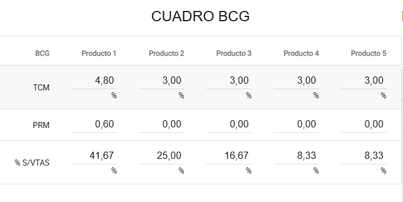
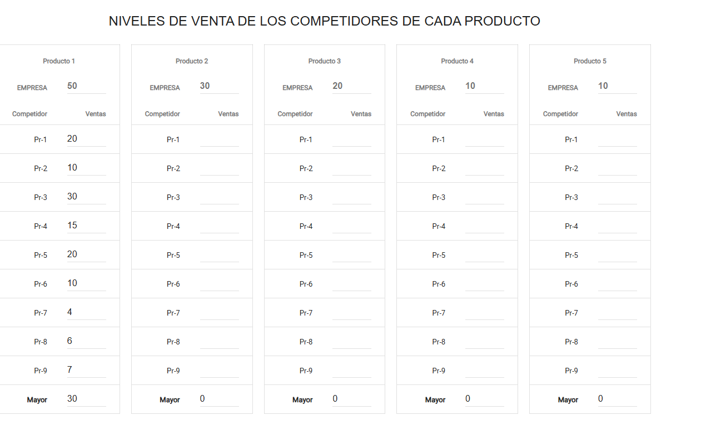
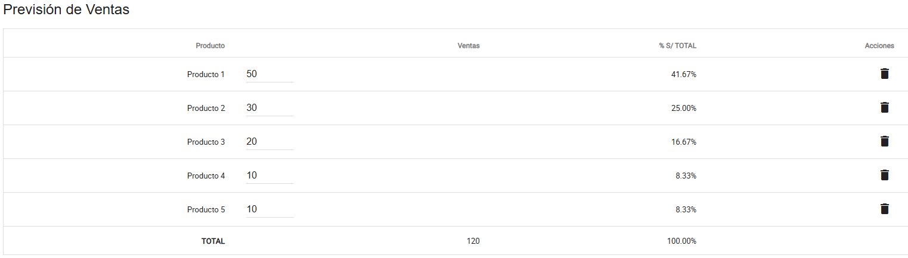
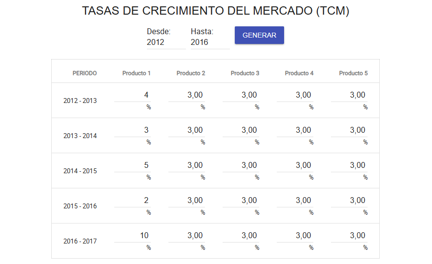
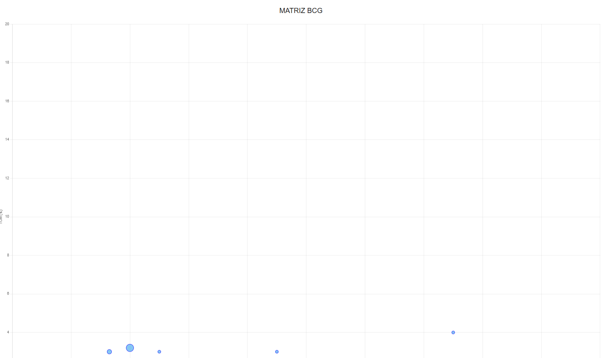

# PE_II_EXAMEN_PRACTICO
**Estudiante:** Alvaro Javier Contreras Lipa (2021070020) - 28 de mayo de 2025
 

**Url del repositorio:** https://github.com/AlvaroContreras13/PE_II_EXAMEN_PRACTICO

# Cambio 1
Anteriormente las tablas eran dinamicas en un 30%, ahora las tablas son 100% dinamicas, cambiando tal cual el excel proporcionado por el docente, enfocandose principalmente en el cuadro BCG para la creacion del grafico.

## 1. Cuadro BCG

## 2. Niveles de Venta de los Competidores

## 3. Previsión de Ventas

## 4. Tasas de Crecimiento del Mercado (TCM)

# Cambio 2
Ahora que las tablas son dinamicas se implmento la creacion de la matriz BCG por cada producto de acuerdo al resultado del cuadro BCG hecho en el cambio1, siendo esta la version 1.0.
## 5. Matriz BCG (Gráfico)

